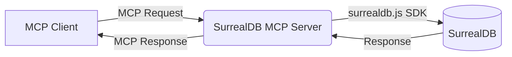

# System Patterns: SurrealDB MCP Server

## Architecture

The system will consist of a single Node.js process acting as an MCP server.

## Key Technical Decisions (Initial)

*   **Language/Runtime:** Node.js (TypeScript eventually, but starting with JavaScript for the test script).
*   **MCP SDK:** `@modelcontextprotocol/sdk` for server implementation.
*   **Database SDK:** `surrealdb.js` for SurrealDB interaction.
*   **Connection:** Maintain a persistent WebSocket connection to the SurrealDB instance within the server process.

## Design Patterns

*   **MCP Server Standard:** Follow the standard request/response pattern defined by the Model Context Protocol for tool calls and resource access.
*   **Configuration:** Utilize environment variables passed via MCP settings for sensitive connection details (API keys, passwords).
*   **Error Handling:** Implement specific error handling for both MCP communication errors and SurrealDB operational errors, translating database errors into appropriate MCP error responses.

*(This file will evolve as the MCP server is built and more complex patterns emerge.)*
